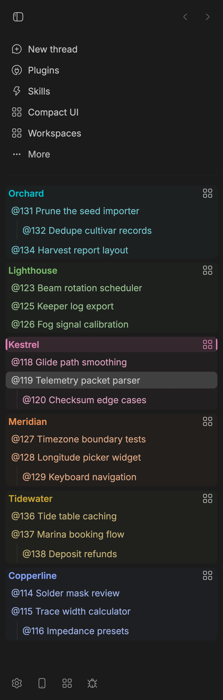

# Workspaces for bb

Switch complete pane arrangements for projects, thread groups and personal threads.



*Demo projects in dark mode with Workspaces 0.2.6 and Compact UI 0.9.5. Compact UI supplies per-project colors, group shading and thread tint; Workspaces marks the active project with a colored heading and rails.*

## Use Workspaces

- Open **Workspaces** from the sidebar or Settings → Plugins → Workspaces.
- Click a project heading or its grid button, use the footer picker, or run **Workspaces: switch workspace** from the command palette.
- Press **⌘⌥1–9** on Mac or **Ctrl+Alt+1–9** elsewhere. Numbers follow sidebar project order. Shortcuts are suppressed while typing, in terminal/editor inputs, during composition, and in modal dialogs.
- Create a thread workspace with its row’s grid button or **Workspaces: make current thread a workspace**. The starting layout contains the anchor and up to five direct children; it does not capture unrelated current panes. Switch back with its persistent icon or searchable workspace picker.
- Plain-clicking a member of a thread workspace switches to its deepest containing workspace by default. Turn off **Clicking a thread in a workspace switches to it** for ordinary within-project navigation. Cross-project clicks still switch to that project’s remembered workspace. Modified clicks keep bb’s native behavior.
- **Threads (no project)** has its own workspace and can contain thread workspaces. Its heading grid, picker and page switch the whole arrangement; it has no digit hotkey.

Layouts are stored in this browser's local storage, not on the bb server. They do not sync across devices. Stock bb reloads the window when switching; hosts exposing the experimental split-layout hook can switch without a reload. On stock bb, navigate to another project before double-clicking a thread to rename it.

## Protect and recover layouts

Matching restored panes resume saving automatically. If the live layout differs from a saved workspace, choose **Restore saved panes** or **Keep current panes**. Management pages for Workspaces, Compact UI and Thread nicknames are excluded from snapshots, including their Settings pages.

**Restore previous layout** recovers one previous revision per workspace. Later changes can replace that revision; this is not an unlimited backup history. **Forget saved layout** resets the saved arrangement. Thread-workspace cleanup requires repeated index misses and server confirmation of deletion or archiving; a missing paginated result alone does not remove a workspace.

## Workspace colors

The active project's sidebar heading has a colored icon, title, background and rails; inactive headings remain distinguishable. Install [Compact UI](https://github.com/mgmobrien/bb-plugin-compact-ui) separately to configure the shared accent from its sidebar page or Settings. Without it, Workspaces uses bb's native green. The header gradient and editor-focus glow work with either one thread pane or a split layout. Compact UI’s Pane header color and Text input glow toggles can turn those accent treatments off independently.

## Plugin identity and stored layouts

The plugin ID is now **pane-workspaces**; its display name remains **Workspaces**. This resolves a marketplace ID collision with a different plugin. The browser storage keys remain `workspaces.v1` and `workspaces.v2` so existing local layouts can be migrated and reused. Disable the previous `workspaces` installation before installing this package; do not run both copies together. GitHub redirects the former repository URL, but the package identity has changed.

Workspace identity stays attached to a thread ID when it moves or is re-parented. Active workspace selection is per window; saved arrangements remain browser-local. Revision checks reject stale saves, but this is not cross-device synchronization.

## Install from source

Requires bb 0.42+ and plugin SDK 0.4.47.

```sh
git clone https://github.com/mgmobrien/bb-plugin-pane-workspaces.git
cd bb-plugin-pane-workspaces
npm ci
npm run typecheck
npm run build
npm test
bb plugin install .
```

Keep the source directory in a durable location. Disable the plugin in bb to remove its controls; browser-local saved layouts remain.

## Compatibility and limitations

Workspaces uses internal host storage, sidebar attributes and the desktop browser-visibility bridge. Future bb changes may require updates. The thread index currently covers up to 400 unarchived threads. Local layouts are not portable backups.

Before a stock desktop reload, the plugin hides native browser views whose IDs it can read from persisted panel records. It preserves browser tabs and URLs. Unknown records are skipped with a warning; a failed visibility call stops the reload and reports an error. Views absent from readable records cannot be discovered this way. The experimental instant-switch path uses normal host cleanup.

The implementation and [upstream investigation](docs/upstream-notes.md) explain the host integrations. Third-party scaffold notices are in [THIRD_PARTY_NOTICES.md](THIRD_PARTY_NOTICES.md).

Built with **MattBot — Matt’s AI assistant (GPT-6 Astra today)**.
